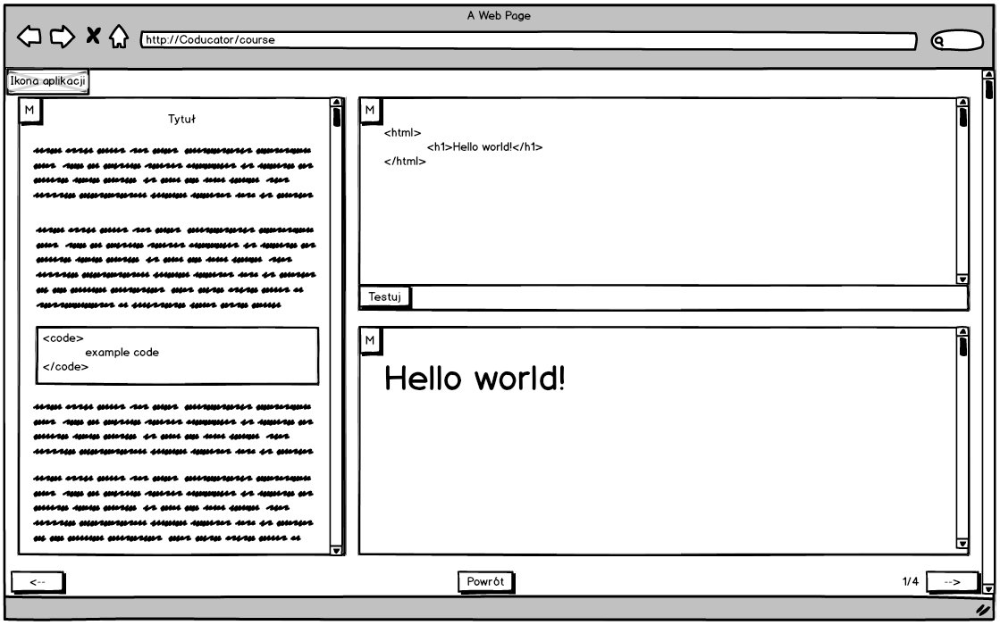

**Dokument techniczny projektu Coducator**

Celem dokumentu jest opisanie działania systemu **Coducator** służącego do przeprowadzania kursów dedykowanych do języków
programowania. System wzorowany jest na podstawie [CodeAcademy](https://www.codecademy.com).

# 1. Wstęp
## 1.1 Terminologia i definicje
Nazwa | Opis
:---: | :---:
MOK | skrót od nazwy Moduł obsługi kont
MOU | skrót od nazwy Moduł obsługi użytkownika
MOA | skrót od nazwy Moduł obsługi administratora

## 1.2 Lista poziomów dostępu (aktorów)
- Użytkownik anonimowy (zwany dalej Anonim) - użytkownik nieuwierzytelniony
- Użytkownik - użytkownik uwierzytelniony
- Administrator - superużytkownik, posiadający najwyższe uprawnienia. Sprawuje rolę zarządcy systemu.

## 1.3 Lista przypadków użycia
Lp. | Oznaczenie | Nazwa | Opis | Role
:---: | :---: | :---: | :---: | :---:
1 | MOK.1 | Rejestracja konta | Rejestracja konta z wykorzystaniem oAuth | Anonim
2 | MOK.2 | Uwierzytelnienie | Proces uwierzytelniania do systemu | Anonim
3 | MOK.3 | Zakończenie sesji użytkownika | Zakończenie sesji użytkownika | Użytkownik, Administrator
4 | MOU.1 | Lista kursów | Pobranie listy kursów | Użytkownik, Administrator
5 | MOU.2 | Lista zadań kursu | Pobranie listy zadań dla kursu | Użytkownik, Administrator
6 | MOU.3 | Wykonaj kod zadania | Kompilacja oraz wykonanie kodu napisanego przez użytkownika | Użytkownik, Administrator
7 | MOU.4 | Zapisz postęp kursu | Zapisanie postępu zadań wykonanych w kursie | Użytkownik, Administrator
8 | MOU.5 | Utwórz kurs | Dodanie nowego kursu z zadaniami | Użytkownik, Administrator
9 | MOU.6 | Modyfikuj kurs | Modyfikacja istniejącego kursu przypisanego do użytkownika | Użytkownik, Administrator
10 | MOU.7 | Dodaj zadanie | Dodanie zadania do kursu przypisanego do użytkownika | Użytkownik, Administrator
11 | MOU.8 | Modyfikuj zadanie | Modyfikacja zadania kursu przypisanego do użytkownika | Użytkownik, Administrator
12 | MOU.9 | Usuń zadanie | Usuwanie zadania kursu przypisanego do użytkownika | Użytkownik, Administrator
13 | MOU.10 | Usuń kurs | Usunięcie istniejącego kursu przypisanego do użytkownika | Użytkownik, Administrator
14 | MOA.1 | Modyfikacja dowolnego kursu | Modyfikacja dowolnego istniejącego kursu | Administrator
15 | MOU.2 | Dodaj zadanie (Admin) | Dodanie zadania do dowolnego kursu | Administrator
16 | MOU.3 | Modyfikuj zadanie (Admin) | Modyfikacja zadania dowolnego kursu | Administrator
17 | MOU.4 | Usuń zadanie (Admin) | Usuwanie zadania dowolnego kursu | Administrator
18 | MOA.5 | Usunięcie dowolnego kursu | Usunięcie dowolnego istniejącego kursu | Administrator
19 | MOA.6 | Usunięcie użytkownika | Usunięcie istniejącego użytkownika z systemu | Administrator

# 1.4 Diagram przypadków użycia wg. aktorów
- Anonim

*Ilustracja 1. Diagram przypadku użycia użytkownika anonimowego*

- Użytkownik

*Diagram przypadku użycia użytkownika uwierzytelnionego*

- Administrator

*Ilustracja 2. Diagram przypadku użycia administratora*

# 2. Opis przypadków użycia
## 2.1 Główne założenia
Pola do których odnosi się opis oznaczane są liczbami oraz literami, np. *pole **3a.*** przedstawia tytuł kursu.
Na szablonach zaznaczono dodatkowo literą **m** te pola, które będą modyfikowalne po kliknięciu na obszar pola.
Przykładowo: *pole **3a.m*** po kliknięciu obszar pola zamienia się w textarea w którym będzie możliwość edycji tytułu kursu.
W opisach znajdują się również odnośniki do innych przypadków użycia za pośrednictwem oznaczenia przypadku użycia 
np. odnośnik **MOU.1** odwołuje się do przypadku użycia listy kursów.
Odnośniki *6. MyCourses* odwołują się do konkretnych widoków zaprojektowanych w Balsamiq Mockup, gdzie "6." oznacza numer ilustracji 
w tym dokumencie, a "MyCourses" nazwę widoku.

Do widoku głównej strony będzie można cofnąć klikając ikonę aplikacji umieszczoną w lewym górnym rogu każdego z widoków (poza widokami 
kreatora kursu oraz zadań).

## 2.2 MOK.1 Rejestracja konta
Rejestracja konta przebiegać będzie zarówno standardową ścieżką (z potwierdzeniem adresu email)jak i za pośrednictwem oAuth 
z wykorzystaniem konta na facebooku, gitlabie oraz google.

*Ilustracja 3. Szablon rejestracji*

## 2.3 MOK.2 Uwierzytelnienie
Uwierzytelnienie możliwe będzie również przy użyciu oAuth z aplikacji wymienionych w **MOK.1**. Dodatkowo sesja zapisywana będzie w 
ciasteczku. Czas życia ciasteczka będzie nieograniczony - usuwane będzie tylko w momencie wylogowania z systemu **MOK.3**.

*Ilustracja 4. Szablon logowania*

## 2.4 MOK.3 Zakończenie sesji użytkownika
Powoduje zakończenie sesji i przekierowanie na widok logowania. Przycisk wylogowania dostępny jest na widoku listy kursów.
W trakcie dodawania kursów, zadań oraz uczenia powinien być niewidoczny.

## 2.5 MOU.1 Lista kursów
Lista kursów dostępna będzie na głównym widoku aplikacji *5. Dashboard*.

*Ilustracja 5. Szablon głównej strony*

Informacje każdego z kursu będą obejmować:
- tytuł kursu *pole **3a.***
- krótki opis kursu *pole **3b.***
- ikonę kursu
- długi opis kursu *pole **3c.***
- sylabus - spis treści kursu generowany na podstawie listy zadań *pole **3d.***
- wymagania - lista wymagań (np. innych kursów) wymaganych do rozpoczęcia kursu *pole **3e.***

Domyślnie gdy użytkownik rozpoczyna kurs, przekierowanie następuje na pierwsze zadanie kursu. Przycisk **2.** prezentuje wtedy
tekst "Rozpocznij". Jeżeli natomiast użytkownik przeglądał wcześniej kurs, przycisk **2.** brzmi "Wznów" a przekierowanie
następuje do ostatniej przeglądanej strony kursu.

Lista kursów powinna być filtrowana po query, które użytkownik podaje w polu wyszukaj *(pola **1a.**, **1b.**, **1c.**)*.
Dodatkowo filtr powinien uwzględniać typ kursu:
- Rozpoczęte kursy - kursy, które użytkownik przeglądał. Uwzględnia to również ukończone kursy. Sortowanie powinno być tutaj po progresie,
przy czym kursy ukończone powinny znajdować się na samym dole, a kursy rozpoczęte na samym początku z sortowaniem od największej ilości 
progresu w dół.
- Lista kursów - dostępne kursy których użytkownik jeszcze nie przeglądał.
- Moje kursy - kursy utworzone przez użytkownika. Prezentowane są na widoku *6. MyCourses*.

*Ilustracja 6. Szablon kursów użytkownika*

## 2.6 MOU.2 Lista zadań kursu
Lista zadań kursu przeglądanego przez użytkownika dostępna z zakładki *7. Learning* po kliknięciu przycisku **2.** na widoku *5. Dashboard*.

*Ilustracja 7. Szablon rozwiązywanego zadania*

W lewym panelu zadania prezentowany będzie tytuł zadania oraz jego opis. Należy uwzględnić fakt, że w opisie może znajdować się 
przykładowy kod.
W prawym górnym panelu znajduje się kod który użytkownik musi uzupełnić aby zaliczyć zadanie. Po kliknięciu przycisku "Testuj" **MOU.3** 
znajdującego się w lewym dolnym rogu panelu, wynik uruchomionego kodu prezentuje się w prawym dolnym panelu oraz jeżeli wynik przeszedł 
filtry sprawdzające rozwiązanie, przycisk przejścia do następnego zadania powinien zostać odblokowany.
Przycisk przejścia do następnego zadania powoduje wywołanie usługi zapisu postępu kursu **MOU.4**.
Przyciski oznaczone na szablonie jako "M" powodują maksymalizacje danego panelu ukrywając przy tym resztę paneli.

## 2.7 MOU.3 Wykonaj kod zadania
Powoduje wykonanie kodu wprowadzonego przez użytkownika w prawym górnym panelu zadania po kliknięciu przycisku "Testuj". 
Może być wywołane z poziomu rozwiązywania zadania **MOU.2** oraz tworzenia/modyfikowania zadania **MOU.7**, **MOU.8**, **MOA.2**, **MOA.3**.
Informacje na temat wykonania kodu powinny uwzględniać:
- wynik wykonania kodu
- flagę czy kod poprawnie przeszedł filtry sprawdzające wynik zadania

## 2.8 MOU.4 Zapisz postęp kursu
Zapis postępu realizowany będzie po kliknięciu w przycisk następnego zadania z **MOU.2**. 
W trakcie zapisu postępu mogą być uaktualnione informacje o:
- progresie danego kursu użytkownika,
- punktacji użytkownika,
- liczbie ukończonych kursów

## 2.9 MOU.5 Utwórz kurs, MOU.6 Modyfikuj kurs

Utworzyć kurs można z poziomu widoku listy zadań użytkownika *6. MyCourses*.

*Ilustracja 8. Szablon kreatora kursu*

Widok kreatora kursu prezentuje listę zadań z widocznym tytułem zadania **4a**, jego krótkim opisem **4b** oraz numeracją zadania.
Obszary zadań są typu drag and drop. Przesunięcie zadania w inne miejsce spowoduje zamienienie jego kolejności na liście.
Po kliknięciu w obszar zadania (poza tekstem) zadania użytkownik przekierowany jest na formularz modyfikacji zadania **MOU.8** lub **MOA.3**.
Przycisk plusa przekierowuje również do kreatora zadań korzystając z **MOU.7** lub **MOA.2**.

Na każdym z zadań widocznych z poziomu kreatora kursu są przyciski do usuwania zadania MOU.9.

## 2.11 MOU.7 Dodaj zadanie, MOU.8 Modyfikuj zadanie

*Ilustracja 9. Szablon kreatora zadania*

W kreatorze zadania możliwe będzie zdefiniowanie:
- treści zadania w której znaleźć może się fragment kodu **5a.**
- przykładowy kod który będzie prezentowany w zadaniu jako do uzupełnienia **5b.**
- przykładowe rozwiązanie zadania **5c.**, które musi przejść walidację rozwiązania definiowaną w **5d.**

Przycisk zapisz zadanie będzie domyślnie nieaktywny do czasu gdy przykładowe rozwiązanie będzie umieszczone i przetestowane.

## 2.13 MOU.9 Usuń zadanie

Na każdym z zadań widocznych z poziomu kreatora kursu są przyciski do usuwania zadania. Po kliknięciu przycisku pojawi się okno alert
z potwierdzeniem usunięcia zadania.

## 2.14 MOU.10 Usuń kurs

Usunąć kurs można z poziomu widoku listy zadań użytkownika *6. MyCourses*. Przycisk *Usuń zadanie*.

## 2.15 MOA.1 Modyfikacja dowolnego kursu

Rozszerzenie **MOU.6** o uprawnienia administratora z możliwością modyfikacji dowolnego kursu.

Użytkownik z uprawnieniami administratora zamiast zakładki *6. MyCourses* będzie miał zakładkę *UsersCourses* która
różnić się będzie tym, że na liście po lewej stronie wylistowane będą wszystkie kursy dodane przez użytkowników.

## 2.16 MOA.2 Dodaj zadanie (Admin), MOA.3 Modyfikuj zadanie (Admin)

Rozszerzenie **MOU.7** oraz **MOU.8** o uprawnienia administratora z możliwością modyfikacji dowolnego kursu.

## 2.18 MOA.4 Usuń zadanie (Admin)

Rozszerzenie **MOU.8** o uprawnienia administratora z możliwością modyfikacji dowolnego kursu.

## 2.19 MOA.2 Usunięcie dowolnego kursu

Rozszerzenie **MOU.10** o uprawnienia administratora z możliwością usunięcia dowolnego kursu.

## 2.20 MOA.3 Usunięcie użytkownika

Użytkownik z uprawnieniami administratora będzie miał przycisk w prawym górnym rogu głównego widoku aplikacji
"Lista użytkowników" który przekieruje na stronę z listą użytkowników z możliwością ich usunięcia 
(przycisk x przy każdym użytkowniku).
